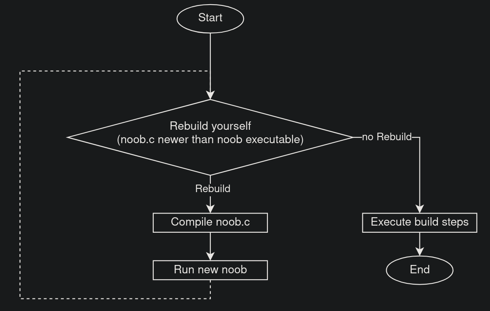

# noob
no (original) build. bootstrapped build system in c.

inspired by tsodings [nob](https://github.com/tsoding/nobuild) in name and idea.

## example
```C
// noob.c
#include "noob.h"

int main(int argc, const char * argv) {
  noob_rebuild_yourself(argc, argv);
  
  noob_cmd *bc = noob_string_create(128);
  // do all your build logic here
  noob_string_append(bc, "gcc main.c -o main");
  noob_run_cmd(bc);
  noob_string_free(bc);

  return 0;
}
```

## basic principle

to build even a complex c project you should only need a c compiler and nothing else, no make, cmake or even shell scripting needed.

noob aims to be a build system you write yourself in c. within the main function of noob.c you'll start out with the rebuildyourself step.

afterwards you construct the build steps for your main project (calling your compiler, linker, ...).

rebuild yourself step:



executing the build system will rebuild itself if needed, after a first compilation, no manual recompilation is needed.

any changes made to the noob.c file will automatically be build and then executed, argc and argv are passed along aswell. 

## documentation

to make life a bit easier when constructing your build i also implemented functions that might help you do just that.

**noob_string**
is a struct to easily build and append to strings (for building commands). use `noob_string_create(int)` to create a buffer with a initial size. you can append using `noob_string_append(noob_string*, const char*)` and the buffer will automatically resize, appending will also add a space between the strings. 
free your strings using `noob_string_free(noob_string*)`.

```C
noob_string *bc = noob_string_create(12);
noob_string_append(bc, "echo");
noob_string_append(bc, "\"hey noob, this is where you would construct your build cmds\"");
```

you can also easily create a noob_string from a string using `noob_string_create_from(const char*)`.

**noob_ensure_dir()**
does exactly what you expect it to, ensures a directory exists. creates it if not there already.

**noob_has_flag()**
detects whether a flag (`./noob DEBUG`) was passed.
```C
int main(int argc, const char **argv) {
  noob_rebuild_yourself(argc, argv);

  if (noob_has_flag(argc, argv, "DEBUG")) {
    printf("Debug build\n");
    // do some stuff here //
  } else {
    // do some other stuff here // 
  }
  // maybe even do some stuff here // 
}
```

**noob_is_outdated(a, b)**
checks whether file b is older than file a.

**noob_run_cmd_async()**
starts a command in a seperate thread. returns said thread.

**noob_join_async()**
joins an async thread and joins it, also frees the command that was run.

**noob_run()**
just runs the command you give it. no overhead with a `noob_string`.
